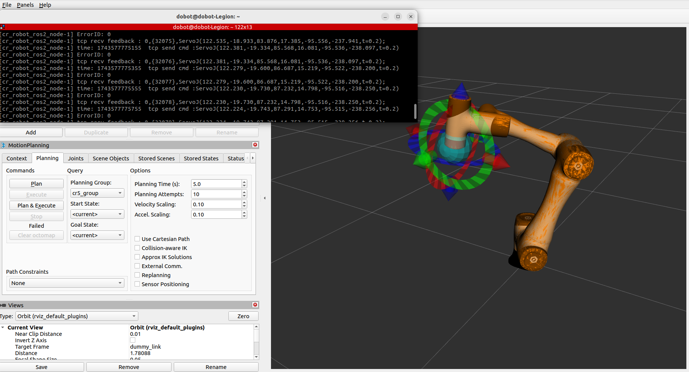

<div align="center">

 

 <h1>DOBOT 6Axis ROS2 V4</h1>

 **越疆机器人 ROS2 软件开发套件**  
 基于 TCP/IP 协议的高性能机器人控制框架

 [简体中文](README.md) · [English](README_EN.md)

 
 
 

 </div>

 ---

 ## 快速开始

 ### 环境要求

 | 要求 | 版本 |
 |------|------|
 | 操作系统 | Ubuntu 22.04 LTS |
 | ROS 版本 | ROS2 Humble Hawksbill |
 | Python | 3.8+ |

 ### 网络配置

 | 配置项 | 说明 |
 |--------|------|
 | 机器人 IP | 192.168.5.1（需与本机同一网段） |
 | 控制端口 | 29999 |
 | 反馈端口 | 30004 |

 ### 安装步骤

 ```bash
 # 创建工作空间
 mkdir -p ~/dobot_ws/src
 cd ~/dobot_ws/src
 git clone https://github.com/Dobot-Arm/DOBOT_6Axis_ROS2_V4.git
 cd ~/dobot_ws

 # 安装依赖
 sudo apt update && sudo apt install -y \
   ros-humble-moveit \
   ros-humble-gazebo-* \
   ros-humble-joint-state-publisher \
   ros-humble-robot-state-publisher

 # 编译
 colcon build --symlink-install
 source install/local_setup.sh
 ```

 ---

 ## 功能演示

 ```bash
 # RViz 可视化
 ros2 launch dobot_rviz dobot_rviz.launch.py

 # MoveIt 虚拟演示
 ros2 launch dobot_moveit moveit_demo.launch.py

 # Gazebo 仿真
 ros2 launch dobot_gazebo dobot_gazebo.launch.py

 # 控制真实机械臂
 ros2 launch dobot_bringup_v4 dobot_bringup_ros2.launch.py
 ros2 launch dobot_moveit dobot_moveit.launch.py
 ```

 ---

 ## 项目结构

 ```
 DOBOT_6Axis_ROS2_V4/
 ├── dobot_bringup_v4/        # 机器人驱动
 ├── dobot_moveit/            # MoveIt 核心功能
 ├── dobot_rviz/              # RViz 可视化
 ├── dobot_gazebo/            # Gazebo 仿真
 ├── cr3_moveit/              # CR3 配置
 ├── cr5_moveit/              # CR5 配置
 ├── cr7_moveit/              # CR7 配置
 ├── cr10_moveit/             # CR10 配置
 ├── cr10af_moveit/           # CR10AF 配置
 ├── cr12_moveit/             # CR12 配置
 ├── cr16_moveit/             # CR16 配置
 ├── cr20_moveit/             # CR20 配置
 ├── cr30h_moveit/            # CR30H 配置
 ├── me6_moveit/              # E6/ME6 配置
 ├── nova2_moveit/            # Nova2 配置
 ├── nova5_moveit/            # Nova5 配置
 ├── cra_description/         # 机器人描述
 ├── misc/                    # 辅助工具与文档
 ├── image/                   # 文档图片
 ├── README.md
 └── README_EN.md
 ```

 ---

 ## 支持型号

 | 系列 | 型号 |
 |------|------|
 | CR 系列 | CR3、CR5、CR7、CR10、CR12、CR16、CR20、CR30H |
 | CRAF 系列 | CR10AF |
 | E 系列 | E6 / ME6 |
 | Nova 系列 | Nova2、Nova5 |

 ---

 ## 启动文件

 | 启动文件 | 说明 |
 |----------|------|
 | `dobot_bringup_ros2.launch.py` | 启动机器人驱动 |
 | `dobot_rviz.launch.py` | 启动 RViz |
 | `moveit_demo.launch.py` | MoveIt 虚拟演示 |
 | `dobot_moveit.launch.py` | MoveIt 控制界面 |
 | `dobot_gazebo.launch.py` | 启动 Gazebo |
 | `gazebo_moveit.launch.py` | Gazebo 与 MoveIt 联动 |

 ---

 ## 注意事项

 > ⚠️ **安全第一**：运行前确保机器人在安全位置

 1. 确保电脑 IP 与机器人在同一网段（192.168.X.X）
 2. 确保端口 29999 和 30004 未被占用
 3. 机器人需处于远程 TCP/IP 控制模式

 ---

 ## 版本信息

 | 信息 | 内容 |
 |------|------|
 | 当前版本 | V4.6.5 |
 | ROS 版本 | ROS2 Humble Hawksbill |
 | 协议版本 | Dobot TCP/IP V4.6.5 |

 ---

 ## 许可证

 [MIT License](LICENSE)

 <div align="center">
 Built by Dobot Team
 </div>